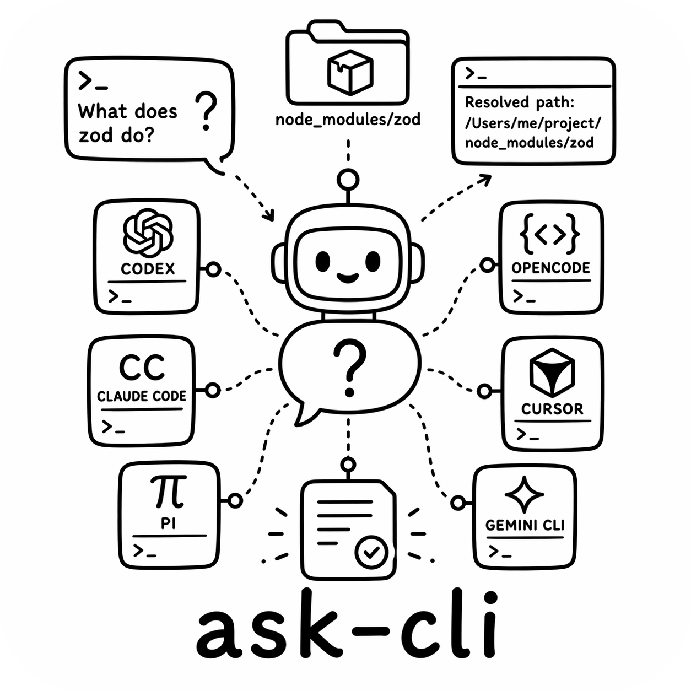

<p align="center">
  
</p>

<h1 align="center">ask</h1>

<p align="center">
  Ask usage questions about installed command-line tools from their local package context.
</p>

<p align="center">
  
  
  
</p>

`ask` resolves a CLI command to the package that installed it, stages a small read-only context bundle, and asks a coding agent to answer from that bundle. It is built for the moments where `tool --help` is not enough and generic web answers are too far away from the version installed on your machine. By default, `ask` runs Headless with the first available supported agent. Pass `--agent none` to inspect the resolved context without calling an agent.

## Quick Start

### With npx

```bash
npx -y @roberttlange/ask prettier "How do I ignore generated files?"
```

### Global install

```bash
npm install -g @roberttlange/ask
ask prettier "How do I ignore generated files?"
```

## 60-Second Usage

```bash
# Ask about an installed CLI using the default agent.
ask zod "What does this package do?"

# Pick a specific Headless backend.
ask --agent codex prettier "How do I ignore generated files?"

# Resolve and stage context without running an agent.
ask --agent claude fixture-cli-npm "How do I enable JSON output?"

# Emit machine-readable output.
ask --json --agent none fixture-cli-py "Which config file does it read?"

# Keep the staged workspace for inspection.
ask --agent none --keep-workspace ruff "Where are lint rules configured?"

# Force an ecosystem resolver when auto-detection is ambiguous.
ask --ecosystem npm prettier "How is config discovered?"

# Ask about a GitHub repository by cloning it and scanning a read-only worktree.
ask --repo RobertTLange/ask-cli --repo-ref main "How is context staged?"

# Skip help/version subprocess collection.
ask --no-exec pip "Where does it read configuration?"

# Print the exact agent prompt for debugging.
ask --verbose --agent none fixture-cli-npm "How do I enable verbose output?"

# Include Headless token/cost accounting when the backend reports it.
ask --usage --agent codex prettier "How is config resolved?"

# Request a normalized Headless reasoning effort.
ask --reasoning-effort high --agent codex cargo-nextest "How do I run one test?"

# Bypass cached context collection.
ask --refresh cargo-nextest "How do I run one test?"
```

## What ask Stages

`ask` creates a temporary workspace containing `ASK_CONTEXT.md` plus selected local package files. The staged bundle can include README files, docs, changelogs, source files, tests, examples, parser/config files, completion scripts, package metadata, and bounded help/version output.

The agent sees that staged workspace as its working directory and receives a prompt that includes the resolved command, package metadata, and the user question.

For repository questions, `ask --repo` clones or fetches the GitHub repository into the local ask cache, checks out the requested branch, tag, or commit into a temporary read-only full worktree, removes `.git`, and asks Headless to inspect that workspace.

## Supported Ecosystems

| Ecosystem | Resolution source |
| --- | --- |
| `npm` | package metadata, bin entries, source files under `node_modules` |
| `python` | entry points, dist-info metadata, import package files |
| `cargo` | local target builds and Cargo registry cache metadata |
| `homebrew` | Cellar package metadata, receipts, formula files, script wrappers |
| `fallback` | executable path, shebang, nearby files, bounded help output |

Use `--ecosystem <name>` to override auto-detection.

## Supported Agents

`ask` delegates agent execution to the [headless-cli](https://www.npmjs.com/package/@roberttlange/headless) and runs it in read-only mode against the staged workspace. When no agent is specified, Headless chooses the first installed backend it supports.

## Output Modes

### 1) Human mode (default)

Human mode prints a resolution summary followed by the agent answer.

```bash
ask prettier "How do I ignore generated files?"
```

### 2) JSON mode (`--json`)

JSON mode prints the command, question, compact resolution metadata, answer, citations, warnings, and optional debug trace.

```bash
ask --json --agent none fixture-cli-npm "How do I enable JSON output?"
```

### 3) Debug mode (`--debug`)

Debug mode writes resolver, cache, collection, and agent trace details to stderr while preserving the normal answer output on stdout.

```bash
ask --debug prettier "How is config resolved?"
```

### 4) Context-only mode (`--agent none`)

Context-only mode resolves the command, collects package context, writes the staged workspace path, and exits without launching Headless.

```bash
ask --agent none --keep-workspace zod "What does this package do?"
```

## CLI Reference

```bash
ask <command> <question> [options]
ask --repo <owner/name|github-url> [--repo-ref <ref>] <question> [options]
```

Options:

- `--ecosystem <e>`: resolver override, one of `python`, `npm`, `cargo`, `homebrew`, `fallback`, or `auto`.
- `--package-root <path>`: use this directory as the package root.
- `--executable <path>`: use this executable path instead of resolving `command` from `PATH`.
- `--repo <repo>`: ask about a GitHub repository instead of an installed command. Accepts `owner/name` or `https://github.com/owner/name[.git]`.
- `--repo-ref <ref>`: branch, tag, or commit for `--repo`. Defaults to the remote default branch.
- `--no-exec`: skip subprocess collection.
- `--allow-help-exec`: permit help/version subprocess collection.
- `--agent <a>`: one of `auto`, `codex`, `claude`, `cursor`, `gemini`, `opencode`, `pi`, or `none`.
- `--agent-timeout <seconds>`: agent timeout. Defaults to `600`.
- `--reasoning-effort <level>`: pass `low`, `medium`, `high`, or `xhigh` to Headless.
- `--json`: emit JSON to stdout.
- `--debug`: write full trace output to stderr.
- `--usage`: include Headless usage accounting when available.
- `--verbose`: print the exact prompt sent to the agent to stderr.
- `--keep-workspace`: preserve the staged workspace on exit.
- `--max-files <n>`: maximum staged file count. Defaults to `200`.
- `--max-bytes <n>`: maximum staged byte count. Defaults to `8388608`.
- `--refresh`: bypass cached context and collect again.
- `-h`, `--help`: show usage.
- `--version`: show the installed version.

## Configuration

`ask` reads optional defaults from:

```text
~/.ask/config.toml
```

Example:

```toml
[defaults]
agent = "claude"
ecosystem = "auto"
maxFiles = 200
agentTimeout = 600
usage = false
reasoningEffort = "high"

[agents.headless]
path = "headless"
extraFlags = ["--model", "sonnet"]
```

See [config.toml.example](config.toml.example) for a copyable config file.

CLI flags override config defaults.

By default, `ask` runs Headless through `npx -y @roberttlange/headless`. Set `agents.headless.path` to use a locally linked binary, and `agents.headless.extraFlags` for additional Headless options such as a model override.

## Security Model

`ask` treats package source, README files, tests, docs, metadata, and help output as untrusted data. Subprocess collection uses an allow-list, closed stdin, `shell: false`, restricted environment, byte caps, timeouts, and process-group cleanup.

Staged workspaces copy files instead of symlinking them, redact common secrets, and chmod staged files read-only. The default Headless adapter runs with `--allow read-only`. Use `--agent none` to inspect the staged context without running any agent.

## Exit Codes

| Code | Meaning |
| --- | --- |
| `0` | success |
| `1` | usage error |
| `2` | resolution failed |
| `3` | context collection failed |
| `4` | agent failed |
| `5` | config error |
| `130` | interrupted |

## Development

```bash
npm install
npm run build
npm test
npm run test:integration:local
npm run hooks:install
```

`npm test` builds the package and runs the Node test suite. `npm run test:integration:local` runs authenticated local integration coverage through Headless and a real agent; set `ASK_INTEGRATION_AGENTS=codex` to limit it to Codex, or `ASK_INTEGRATION_AGENTS=all` to run every supported backend. After `npm run hooks:install`, the pre-push hook builds the local CLI and runs Codex integration by default; set `ASK_HOOK_ALL_AGENTS=1` to run all agents, or `ASK_SKIP_INTEGRATION_HOOK=1` to bypass once. Set `ASK_INTEGRATION_HEADLESS_BIN=/path/to/headless` to test against a specific Headless binary and `ASK_INTEGRATION_TIMEOUT_MS=300000` to adjust per-command timeout. The package exports one binary, `ask`, from `bin/ask.js`.

## Layout

```text
bin/ask.js              CLI binary entrypoint
src/cli/                CLI parsing, config, execution
src/resolvers/          executable and package resolution
src/collectors/         bounded context collection
src/workspace/          staged read-only workspace creation
src/agents/             Headless and context-only adapters
src/cache/              local context cache
tests/                  resolver, collector, workspace, CLI coverage
docs/logo.png           README image
```
